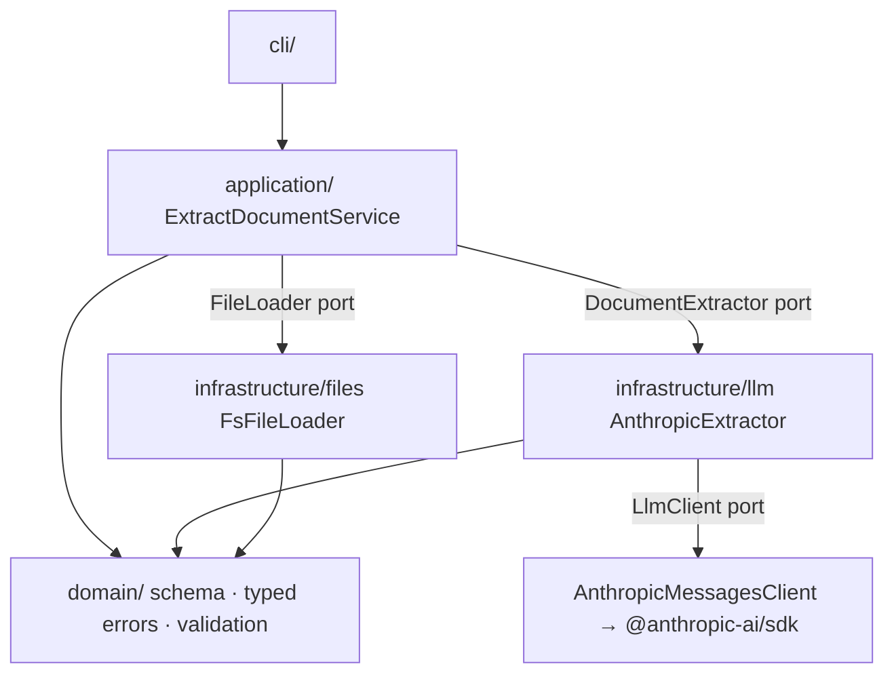

# doc-extract-agent

> Turn invoices (PDF & images) into **validated, structured data** with Claude — built for reliability, not just a happy-path demo.

[](https://github.com/takuyahoritacromtech/doc-extract-agent/actions/workflows/ci.yml)
[](./LICENSE)


A self-hostable agent that reads a business document, extracts the fields you care about, **validates them**, and tells you **what a human should double-check**. The interesting part is not "call an LLM" — it is everything around it that makes an LLM safe to put in a pipeline: typed errors, retries with backoff, strict schema validation, and a human-in-the-loop-ready data model.

> 🎥 **Demo:** run `npm run demo` for an instant **no-API-key** sample, or see **[docs/DEMO.md](./docs/DEMO.md)** to record a GIF / run on a real invoice.

---

## 日本語の概要

帳票（請求書などの PDF・画像）を Claude で構造化データに変換する、セルフホスト可能なツールです。要点は「LLM を呼ぶこと」ではなく、**LLM を業務パイプラインに安全に組み込むための周辺設計**にあります。

- **壊れにくい設計＋エラーハンドリング**：失敗ごとに型付きエラー（コード＋原因＋**対処ヒント**）。`[FILE_TOO_LARGE] 12.3 MB > 上限 10 MB. Hint: 分割するか DOC_EXTRACT_MAX_FILE_MB を上げる` のように、メッセージだけで原因と対処が分かる。
- **テストで証明**：ハッピーパスだけでなく、全エラー経路・リトライ・バックオフを Vitest で検証（Anthropic API はモック）。
- **責務分離**：domain / application / infrastructure / cli のレイヤ構成。依存はインターフェース越しで差し替え・テストが容易。
- **Human-in-the-loop**：フィールド単位の信頼度としきい値で「人が見るべき箇所」を提示。合計が合わない等の業務ルール違反は警告として返す（`--strict` で fail-closed）。
- **セキュリティ**：API キーは環境変数のみ・ログ秘匿、ファイルの mime/サイズ検証、文書本文（PII）は非ログ。

使い方は下の [Quick start](#quick-start) を参照。

---

## Features

- 📄 **PDF & image input** (`.pdf`, `.png`, `.jpg`, `.jpeg`, `.webp`).
- 🧱 **Single source of truth for the schema** — one Zod schema drives the TypeScript types, the LLM tool definition (via Zod's built-in `z.toJSONSchema()`), and runtime validation. No hand-maintained duplicate.
- 🛡️ **Typed errors with actionable hints** — branch on `error.code`, show `error.displayMessage`.
- 🔁 **Retries with exponential backoff** for transient failures (429 / 5xx / timeouts); non-retryable errors (e.g. auth) fail fast.
- 👀 **Human-in-the-loop ready** — per-field confidence + business-rule reconciliation flag exactly what to review.
- 🔌 **Library, CLI, or HTTP service** — embed `ExtractDocumentService`, run `doc-extract`, or self-host `POST /extract`.
- 🐳 **Docker image**, non-root, multi-stage.
- ✅ **Tested**: unit tests cover the happy path **and** every error branch.

## Architecture

Dependencies point inward (hexagonal / ports & adapters). The use case depends on
interfaces; the filesystem and Anthropic SDK are swappable adapters — which is exactly
why the whole thing is testable without touching a real API.



| Layer | Responsibility | Knows about |
| --- | --- | --- |
| `domain/` | Schemas (Zod), typed errors, pure business validation | nothing else |
| `application/` | Orchestration use case + ports (`FileLoader`, `DocumentExtractor`) | `domain` |
| `infrastructure/` | Adapters: filesystem, Anthropic SDK, output, logging | `domain`, `application` ports |
| `cli/` | Argument parsing & wiring | everything (composition root) |

## Quick start

```bash
git clone https://github.com/takuyahoritacromtech/doc-extract-agent.git
cd doc-extract-agent
npm install
cp .env.example .env   # then set ANTHROPIC_API_KEY
npm run build

# Extract to JSON (stdout)
node dist/cli/index.js path/to/invoice.pdf

# Extract to CSV, write to a file
node dist/cli/index.js path/to/invoice.png --format csv --out invoice.csv

# Fail the process if totals don't reconcile (for fail-closed pipelines)
node dist/cli/index.js path/to/invoice.pdf --strict
```

### Use as a library

```ts
import {
  ExtractDocumentService,
  FsFileLoader,
  AnthropicExtractor,
  AnthropicMessagesClient,
  loadConfig,
} from 'doc-extract-agent';

const config = loadConfig();
const service = new ExtractDocumentService({
  fileLoader: new FsFileLoader({ maxFileBytes: config.maxFileBytes }),
  extractor: new AnthropicExtractor(
    AnthropicMessagesClient.fromApiKey(config.anthropicApiKey),
    { model: config.model, maxRetries: config.maxRetries },
  ),
});

const result = await service.run('invoice.pdf', { reviewThreshold: 0.75 });
if (result.needsReview) {
  console.warn('Review needed:', result.warnings, result.fields.filter((f) => f.needsReview));
}
```

### Run as an HTTP service

```bash
npm run build && npm run serve   # listens on $PORT (default 3000)
```

```bash
# Health check
curl -s localhost:3000/health        # {"status":"ok"}

# Extract: send the document bytes base64-encoded
curl -s localhost:3000/extract \
  -H 'content-type: application/json' \
  -d "{\"fileName\":\"invoice.png\",\"base64\":\"$(base64 -i invoice.png)\"}" | jq
```

The server is dependency-free (`node:http`), bounds the request body, validates input,
and maps every domain error to the right status (e.g. `429` rate limit, `413` too large,
`422` unparseable/validation) with a JSON `{ error: { code, message, hint } }` body.

## Error handling

Every deliberate failure is a typed `DocExtractError` with a stable `code`, an actionable
`hint`, and a `retryable` flag. `error.displayMessage` renders `[CODE] message Hint: …`.

| Code | Meaning | Retryable | Typical hint |
| --- | --- | --- | --- |
| `CONFIG_INVALID` | Missing/invalid env config | no | Set the required env vars (see `.env.example`) |
| `FILE_NOT_FOUND` | Path missing or not a file | no | Check the path is correct and readable |
| `FILE_TOO_LARGE` | Exceeds size limit | no | Split the doc or raise `DOC_EXTRACT_MAX_FILE_MB` |
| `UNSUPPORTED_FILE_TYPE` | Extension not supported | no | Use `.pdf/.png/.jpg/.jpeg/.webp` |
| `LLM_AUTH` | API auth failed (401/403) | no | Verify `ANTHROPIC_API_KEY` |
| `LLM_RATE_LIMIT` | Rate limited (429) | yes | Lower concurrency; auto-retried with backoff |
| `LLM_TIMEOUT` | Timeout / connection error | yes | Check connectivity; auto-retried |
| `LLM_SERVER` | Upstream 5xx | yes | Transient; auto-retried |
| `LLM_UNKNOWN` | Unexpected provider error | no | Inspect `cause` |
| `EXTRACTION_PARSE_FAILED` | Output didn't match schema | no | Try a clearer scan; see `error.issues` |
| `VALIDATION_FAILED` | Business rule failed (strict) | no | Re-run without `--strict` to get data + warnings |

## Reliability & human-in-the-loop

- **Retries**: only `retryable` errors are re-attempted, with exponential backoff + jitter
  (250 ms → 8 s cap). The final error includes the attempt count.
- **Strict schema validation**: the model is forced to answer via a tool whose JSON Schema
  is derived from the Zod schema; the response is then re-validated with the same Zod schema
  at runtime. Belt and suspenders.
- **Business reconciliation**: line items vs. subtotal, subtotal + tax vs. total, and
  `quantity × unitPrice` vs. `amount` are checked within a tolerance. By default these become
  `warnings` + `needsReview` (you still get the data); `--strict` turns them into a hard error.
- **Field-level confidence**: `fieldConfidence` + `reviewThreshold` mark exactly which fields a
  human should verify — instead of re-reviewing the whole document.

## Security

- API key is read from the environment only; **never committed** (`.env` is git-ignored) and
  **redacted** from logs.
- Document bytes (potential PII) are treated as sensitive and **never logged**.
- File **type and size are validated before reading** bytes into memory.
- Docker image runs as a **non-root** user.
- Note: by design, document images are sent to the Anthropic API. A fully on-prem model
  backend is on the roadmap for data-residency-sensitive deployments.

## Configuration

| Env var | Default | Description |
| --- | --- | --- |
| `ANTHROPIC_API_KEY` | — (required) | Anthropic API key |
| `DOC_EXTRACT_MODEL` | `claude-sonnet-4-6` | Vision-capable model id |
| `DOC_EXTRACT_MAX_FILE_MB` | `10` | Reject larger documents |
| `DOC_EXTRACT_MAX_RETRIES` | `3` | Retries for transient LLM failures |
| `DOC_EXTRACT_REVIEW_THRESHOLD` | `0.75` | Fields below this confidence need review |
| `LOG_LEVEL` | `info` | `fatal\|error\|warn\|info\|debug\|trace` |

## Testing

```bash
npm run check        # typecheck + lint + test
npm test             # unit tests
npm run test:coverage
```

Tests mock the Anthropic client, so they are fast, deterministic, and need no API key.
They assert the **happy path and every error branch** — malformed output, schema mismatch,
retry-then-succeed, give-up-after-N, non-retryable fail-fast, oversized/unsupported/missing
files, and business-rule reconciliation (lenient and strict).

## Design decisions (the "why")

- **Hexagonal layering** so the LLM and filesystem are swappable adapters and the core logic is
  unit-testable without a network. (See `AnthropicExtractor` taking an `LlmClient` port.)
- **Zod as the single source of truth** — types, the model's tool schema, and runtime
  validation all come from one definition; they cannot drift.
- **Nullable, not optional, fields** so the model always emits every key — an explicit `null` is
  easier to review than a missing property.
- **Warnings by default, errors on demand** — extraction that "mostly worked" should still return
  data with flags, not throw away the result; `--strict` exists for fail-closed pipelines.
- **Errors carry hints** so on-call humans can act from the log line alone.

## Roadmap

- [ ] Human-in-the-loop **review UI** (web) over the `needsReview` data model
- [x] HTTP API (`POST /extract`) · [ ] webhook connector
- [ ] More document types (receipts, purchase orders) via pluggable schemas
- [ ] Optional **on-prem / local model** backend for data-residency-sensitive use

## License

MIT © Takuya Horita
